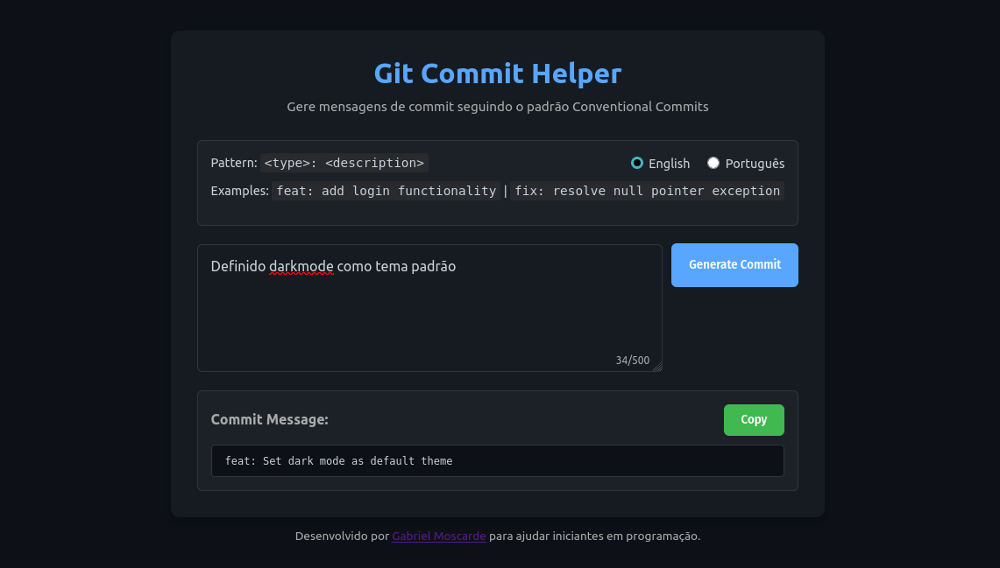

# Git Commit Helper



## 📝 Sobre o projeto

O Git Commit Helper é uma ferramenta web que ajuda desenvolvedores, principalmente iniciantes, a criarem mensagens de commit claras e padronizadas seguindo a especificação [Conventional Commits](https://www.conventionalcommits.org/).

Com esta ferramenta, você pode:

- Gerar mensagens de commit padronizadas
- Escolher entre português e inglês
- Transformar descrições simples em commits profissionais
- Facilitar a manutenção de um histórico de projeto organizado

## 🌐 Versão Online

Experimente a versão online: [Git Commit Helper](https://git-commit-helper.vercel.app/) 

> **Nota**: A versão online tem um limite de 3 gerações de commits por dia por usuário devido às limitações da API gratuita do Google Gemini.

## 🚀 Como executar localmente

Para executar o projeto em sua máquina sem limitações de uso, siga estas instruções:

### Pré-requisitos

- Python 3.8 ou superior
- pip (gerenciador de pacotes do Python)
- Uma chave de API do Google Gemini

### Passo 1: Clonar o repositório

```bash
git clone https://github.com/Moscarde/git-commit-helper.git
cd git-commit-helper
```

### Passo 2: Configurar o ambiente virtual (opcional, mas recomendado)

```bash
# No Windows
python -m venv venv
venv\Scripts\activate

# No Linux/MacOS
python -m venv venv
source venv/bin/activate
```

### Passo 3: Instalar as dependências

```bash
pip install -r requirements.txt
```

### Passo 4: Obter uma API Key do Google Gemini

1. Acesse a [Plataforma Google AI](https://ai.google.dev/)
2. Faça login com sua conta Google
3. No menu, acesse "API Keys" (Chaves API)
4. Clique em "Create API Key" (Criar chave API)
5. Copie a chave gerada

### Passo 5: Configurar as variáveis de ambiente

1. Crie um arquivo `.env` no diretório raiz do projeto:

```bash
cp .env.example .env
```

2. Abra o arquivo `.env` em um editor de texto e preencha com sua chave API:

```
API_KEY=sua_chave_api_aqui
```

### Passo 6: Executar a aplicação

```bash
# No diretório raiz do projeto
python app.py
```

A aplicação estará disponível em `http://127.0.0.1:5000` no seu navegador.

## 🧠 Como usar

1. Acesse a aplicação (online ou localmente)
2. Escolha o idioma desejado (português ou inglês)
3. Preencha:
   - **Descrição**: O que você fez no código
   - **Arquivos alterados** (opcional): Liste os principais arquivos modificados
   - **Contexto adicional** (opcional): Forneça qualquer informação relevante
4. Clique em "Gerar Commit"
5. Copie a mensagem gerada para usar no seu terminal


## 🛠 Tecnologias utilizadas

- **Backend**: Python com Flask
- **Frontend**: HTML, CSS, JavaScript
- **IA**: Google Gemini API
- **Deploy**: Vercel

## 📊 Limitações

- Versão online: 7 gerações de commits por dia por usuário
- Versão local: Sem limitações, desde que respeitados os limites da sua chave API

## 👥 Contribuições

Contribuições são bem-vindas! Sinta-se à vontade para abrir issues ou enviar pull requests com melhorias.

1. Faça um fork do projeto
2. Crie uma branch para sua feature (`git checkout -b feature/nova-feature`)
3. Commit suas mudanças (`git commit -m 'feat: adiciona nova feature'`)
4. Push para a branch (`git push origin feature/nova-feature`)
5. Abra um Pull Request

## 📄 Licença

Este projeto está licenciado sob a [MIT License](LICENSE).

## 📬 Contato

- GitHub: [@Moscarde](https://github.com/Moscarde)
- Linkedin: [/Moscarde](https://linkedin.com/in/moscarde)
---

<p align="center">Desenvolvido com 💻 por Gabriel Moscarde</p>